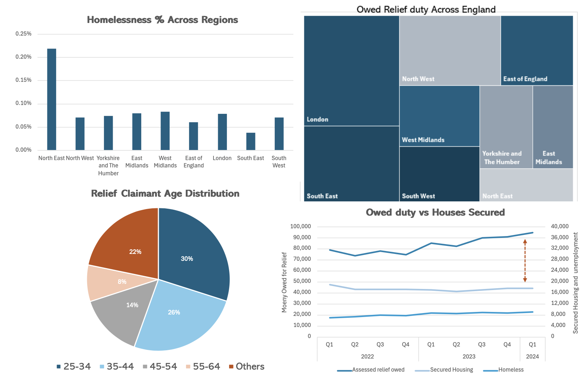

# Analysis of Homelessness Relief Figures (2024)
## **Motivation:** 

Homelessness is a pressing social issue, and I wanted to understand how government spending impacts homelessness rates across different regions. This project involves a time-series analysis of relief spending relative to housing procurement and a geographical analysis of homelessness figures across the UK. The goal was to identify trends and disparities that could inform policy decisions.

- **OneDrive Link:**
  [Access Excel File](https://onedrive.live.com/personal/c88ea4021b131a70/_layouts/15/Doc.aspx?resid=C88EA4021B131A70!s4ba9686b3553450bb4dc9e1c5d18dffe&cid=c88ea4021b131a70&migratedtospo=true&app=Excel)

- **Data Source:**
  
  [UK GOV - Statutory Homleness - 2024](https://www.gov.uk/government/statistical-data-sets/live-tables-on-homelessness)
  
  [ONS GOV UK - Inflation and Price Indices - 2024](https://www.ons.gov.uk/economy/inflationandpriceindices/articles/costoflivinginsights/food)
  
  [Nationwide - House Price Index - 2024](https://www.nationwidehousepriceindex.co.uk/resources/f/uk-data-series)

  

## **Project Snapshot:**

## **I. UK Homlessness Rates Across England**

With a new Labour Party government recently elected, building homes is at the top of the agenda as property prices and living costs skyrocket,
all of this is in an effort to reduce purchase and rental costs with intent to alleviate the burden of UK residents.

UK house prices reached around £262,000 in 2024 compared to 181,000 in 2007. 

source: [Nationwide - House Price Index - 2024](https://www.nationwidehousepriceindex.co.uk/resources/f/uk-data-series)

January 2024 saw an inflation rate of 7%. 

source: [ONS GOV UK - Inflation and Price Indices - 2024](https://www.ons.gov.uk/economy/inflationandpriceindices/articles/costoflivinginsights/food)

It is fair to say that the new government has a hard job ahead of them, with the previous government failing to resolve the growing demand for houses.
But what about the people who are the most at risk?

## **Homelessness in the UK**
A 2024 report by the government dating back to August 2024 provides data on owed relief and homeless figures from the second quarter of 2018 to the first quarter of 2024. 

Before we go further into the report, it is important to know that owed relief is the money assessed owed by the government to UK residents who are threatened with homelessnessor currently homeless. 
We use this measure as an estimate of government spending on homlessness previention and relief. 

By analysing the regional data, we can get a quick glimpse at what areas are most affected by homelessness.

source: [UK GOV - Statutory Homleness - 2024](https://www.gov.uk/government/statistical-data-sets/live-tables-on-homelessness)

We can see that the North-East is most affected by homelessness. This is likely due to historical shifts in the UK economy which pushed jobs towards other regions.

Looking at the median house price to median residence earning ratio, we can see that this is not directly due to housing affordability.
A high ratio would suggest the price is higher relative to earnings, meaning housing is less affordable. 

source: [ONS GOV UK - House Prices to Growth Earnings Ratio](https://www.ons.gov.uk/peoplepopulationandcommunity/housing/datasets/housepriceexistingdwellingstoresidencebasedearningsratio)

The North East has the lowest ratio which tells us there housing is more affordable than in other regions. This suggests the higher homeless rate might be more due to social reasons such as access to social care, family support, or education.

## **Spending on homelessness prevention and relief**

We selected the assessed total owed relief measure to represent government spending on prevention and relief. The tree map below shows the proportion of spending across regions.

London spent the most on relief and prevention with 22% of total spending. The differences in spending most likely due to population and cost of living disparities across regions.

As we can see from the chart the London has a population of around 9 million, comparable to the South East. Whilst, other regions are less populated, the North East holding a population of nearly 3 million.

source: [ONS GOV UK - Estimate of Population for England and Wales - 2024](https://www.ons.gov.uk/peoplepopulationandcommunity/populationandmigration/populationestimates/datasets/estimatesofthepopulationforenglandandwales)

source: [ONS GOV UK - Private Rent and House Prices - 2024](https://www.ons.gov.uk/economy/inflationandpriceindices/bulletins/privaterentandhousepricesuk/august2024)

