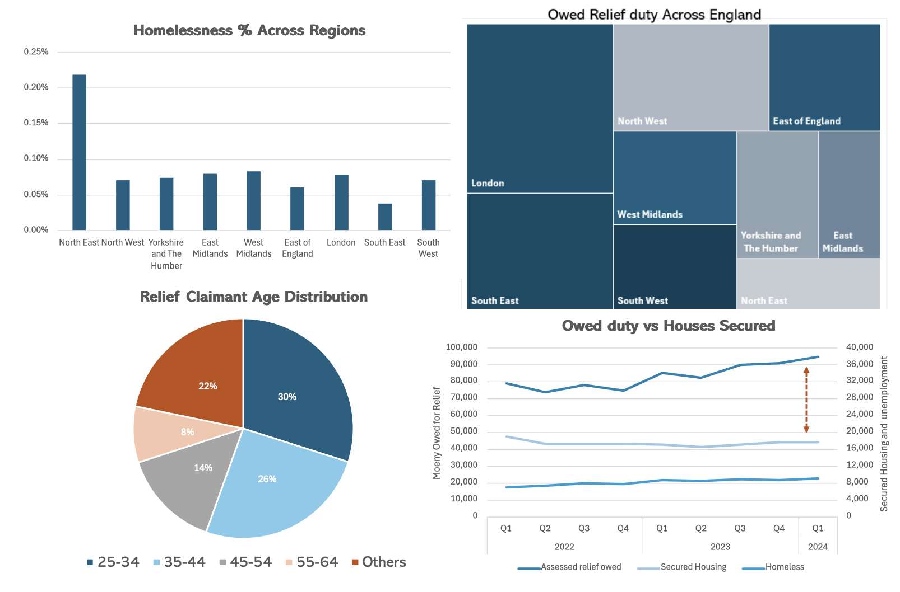
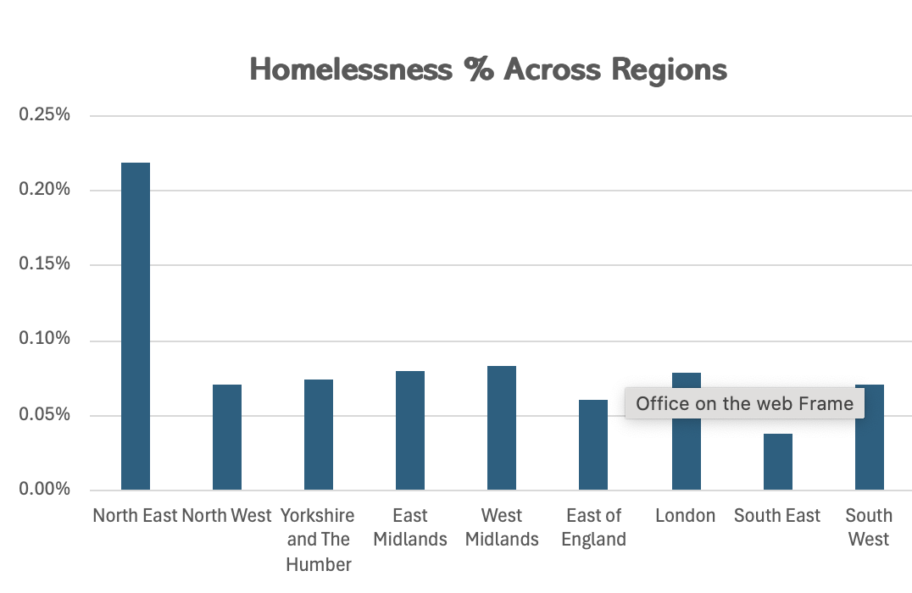

## 1. Analysis of Homelessness Relief Figures (2024)
**Motivation:** Homelessness is a pressing social issue, and I wanted to understand how government spending impacts homelessness rates across different regions. This project involves a time-series analysis of relief spending relative to housing procurement and a geographical analysis of homelessness figures across the UK. The goal was to identify trends and disparities that could inform policy decisions. 

- **OneDrive Link:**
  [Access Excel File](https://onedrive.live.com/personal/c88ea4021b131a70/_layouts/15/Doc.aspx?resid=C88EA4021B131A70!s4ba9686b3553450bb4dc9e1c5d18dffe&cid=c88ea4021b131a70&migratedtospo=true&app=Excel)

- **Data Source:**
  [UK Government Statistical Data on Homelessness](https://www.gov.uk/government/statistical-data-sets/live-tables-on-homelessness)

- **There are significant differences across regions. The North-East has the highest rate (0.22%)**

