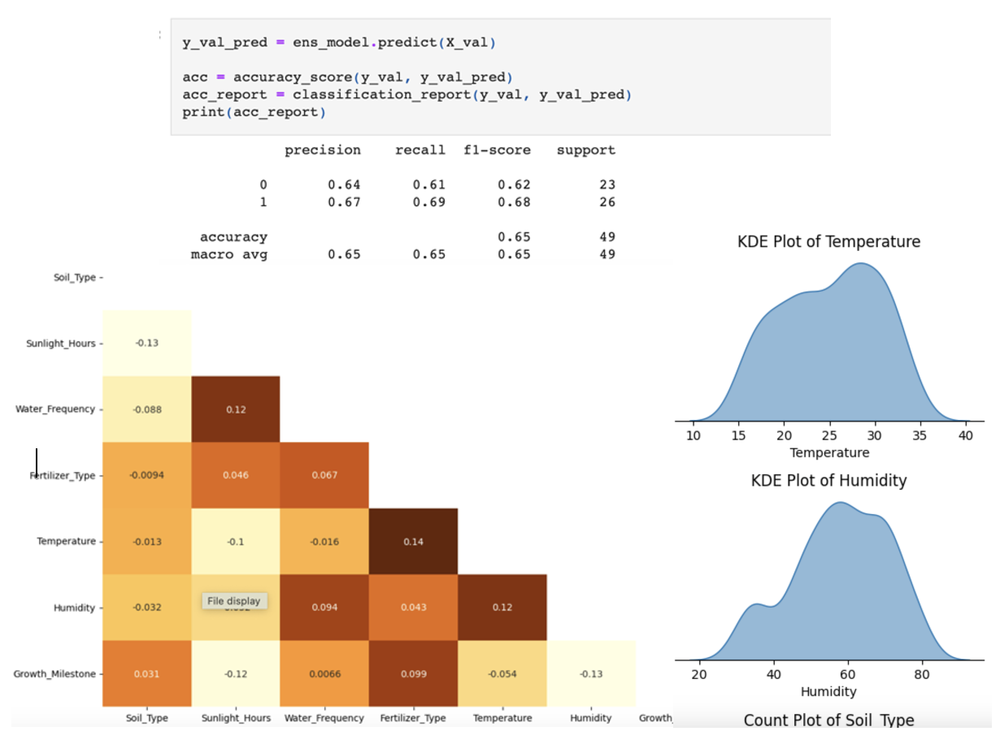

## 2. Classification of Plant Growth Using Machine Learning

**Motivation:** Understanding plant growth is essential for improving agricultural practices and ensuring crop yield. 
This project involved developing a machine learning model to classify plant growth stages based on various features such as 
soil quality, water availability, and environmental conditions. The aim was to provide insights that could enhance farming strategies 
and contribute to more efficient plant cultivation.

