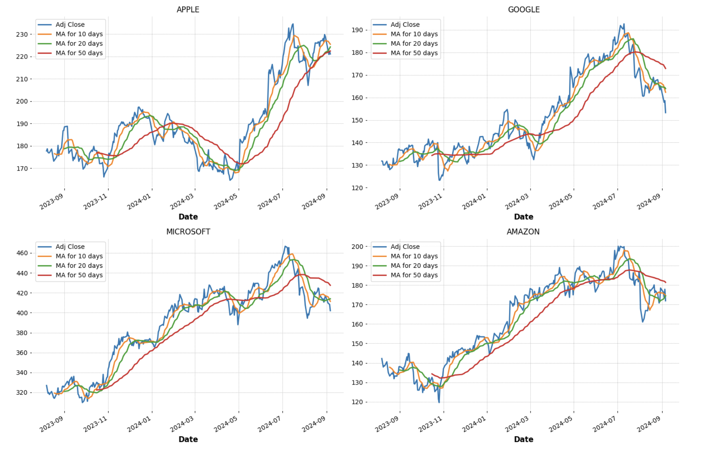
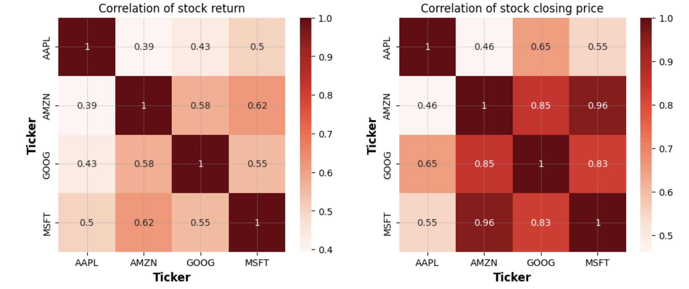
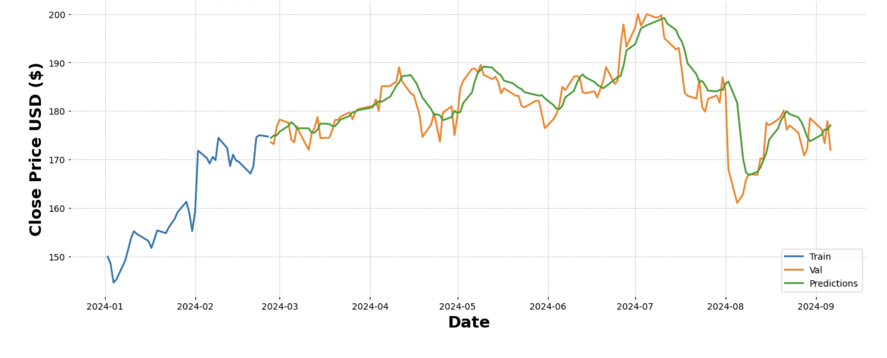

## 2. Analysis of tech stock Market: 2014 - 2024

**Motivation:**
The tech industry plays a crucial role in the global economy, and I wanted to explore how market trends impact the stock prices of major tech companies like Facebook, Google, Amazon, and Microsoft. This project involves a detailed analysis of stock price movements over time, with a focus on identifying patterns and factors influencing these trend. I then proceed to test the predictions of an LSTM machine learning model on future stock prices by comparing the prediction with the actual values of stock prices. The goal is to provide insights that could guide investment decisions and a deeper understanding of the tech market landscape.

