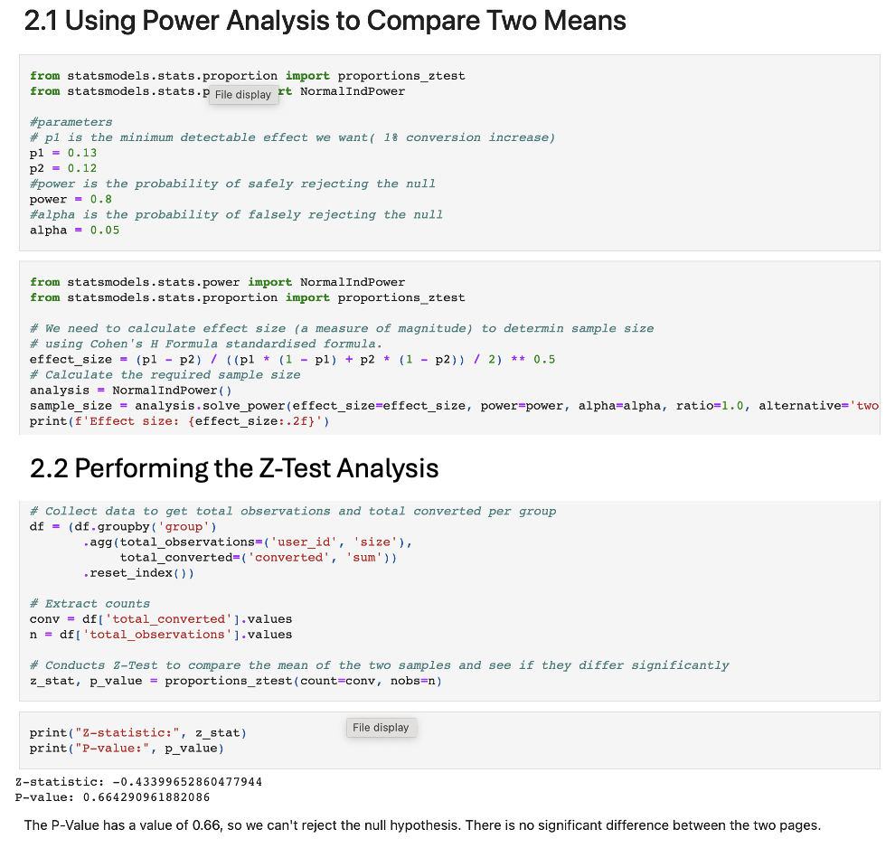

## 3. A/B Test on Landing Page Conversion Rates

**Motivation:** Conversion rates are crucial for optimizing user engagement and achieving business goals. 
This project involved conducting an A/B test to evaluate whether there was a significant difference in conversion rates between 
two different landing pages. The goal was to determine which page design led to higher user conversions and to provide data-driven 
recommendations for improving page effectiveness.

- **Python File Link:**
  [A/B-Testing](https://github.com/Tris123FC/Portfolio/blob/main/3_ab_test/ab-testing-new-page-conversion.ipynb)

