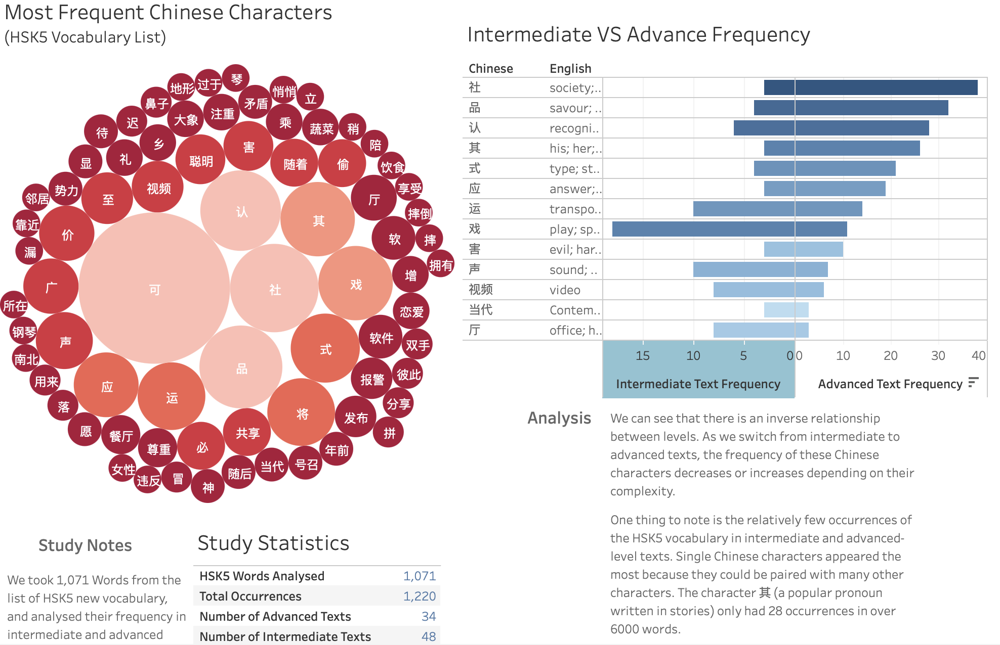

# Analysis of Chinese Vocabulary in the HSK5 Textbook

## Motivation:
Understanding and mastering the vocabulary for the HSK5 (Hànyǔ Shuǐpíng Kǎoshì Level 5) Chinese proficiency exam is crucial for learners aiming to reach advanced language skills. This analysis involved examining the target vocabulary of the HSK5 level and assessing their frequency in both intermediate and advanced texts. By analyzing the occurrence of these words in different levels of difficulty, the project aimed to uncover trends in vocabulary usage, determine which words are most critical for achieving fluency, and provide insights for more effective language learning strategies. The goal was to guide learners and educators in optimizing study plans and ensuring better preparation for real-world language use.

**Data Source:**

[Tableau - Chinese Character Analysis](https://public.tableau.com/app/profile/tristan.cross/viz/AnAnalysisofHSK5CharacterFrequencyinIntermediatetoAdvancedText/Dashboard1#1)

[Scrapped Website - Level Reading Webpage](https://hskreading.com)

[HSK5 - Vocabulary List](https://mandarinbean.com/new-hsk-5-word-list/)

## Project Snapshot

## Topic Introduction

Language learning is a passion of mine as it is for many other. There is nothing more satisfying than reaching a level where you are able to communicate with native speakers, and this is true for every language, as you suddenly feel engrossed in the culture surrounding the language. This reminds of a time when I was in the back of a Chinese taxi, and the driver started to ask me all of these questions. Chinese taxi drivers are notoriously known for their excessive friendly nature: if you are able to say "Hello" in Chinese, they will praise you for your authentic level of Chinese so you often just nod and smile as they keep talking to you , but after 3 years of studying Chinese intensely, when the driver started talking to me, and I was able to respond back, that was probably one of my proudest moments. Unfortunately, to get to this level, a great amount of studying is needed, and the most annoying part of learning a language, is studying the textbook.

## The Textbook

The main textbook for studying chinese language is titled HSK (Hànyǔ Shuǐpíng Kǎoshì) or in English, Chinese Level Test. It comes in six installements, from HSK1 to HSK6. 

Below is a break down of the vocabulary count according to each installement:

Books increase in difficulty, only requiring learners to study 150 characters at first, gradually increasing in difficulty until they are familiar with 2500 characters. I currently finished reading the HSK5 book, so I am supposed to know 2500 words (supposed...). The problem is that I don't, and it is because most of the time you don't use the textbook vocabulary in your conversation, or even in writing. But even though these vocabulary words aren't often seen in practice, they are essential building blocks, providing you with the foundations to study the vocabulary that you want to use to communicate with friends or business partners.

This is the reason for my analysis: I want to decypher the new word vocabulary in the HSK5 books to find trends and patterns which might assist learners who are also at the textbook stage.

Below you will find a diagram which gives an overview of the process:

**Step 1:** Identifying the Data Source:

We need a reference for the HSK5 vocabulary list and a source of texts for Chinese learners seperated by proficiency level.
The reference for the HSK5 vocabulary list was easy to find, and can be asscessed from [mandarinbean.com](https://mandarinbean.com/new-hsk-5-word-list/).

After researching and comparing websites, I assessed the best website for data collection was [hskreading.com](https://hskreading.com). The chosen website possessed over 100 texts seperated by levels from beginner, to advanced.

**Step 2:** Gathering the data:

Due to the quantity of texts and the amount of characters involved. The only way to gather the data was using programming. I created a simple scraping tools which was able to open the the sections of the website which we are interested, go through the list of texts and copy the them into a word document. This process was not ideal as the Word software would struggle with the amount of chinese text characters copied into the file, however after succesfully copying all of the texts from the website to the word file, I did not need to open the files through the software as I could access it through a simple python program. I was able to count all of the characters in the Word document that are in the HSK5 reference list and input the data into a Excel table. The result is a list of HSk5 vocabulary list which a count of their occurences in intermediate and advanced text.

**Step 3** Checking the output data:

After running the program to count the occurences of vocabulary words, quikly comparing the data in the Excel and Word documents proved that the data was valid and reliable. Looking at the quantity of characters in the text we gathered, I decided that the amount of data was sufficient for a basic analysis of character occurences in texts.

**Step 4** Reading the data:

We have gathered the data and organised it into table format. Now comes the fun part, visualising and intepreting data.
For this analysis I chose to use Tableau public as it provides an intuitive platform for designing charts eye-catching charts with interactive elements.

