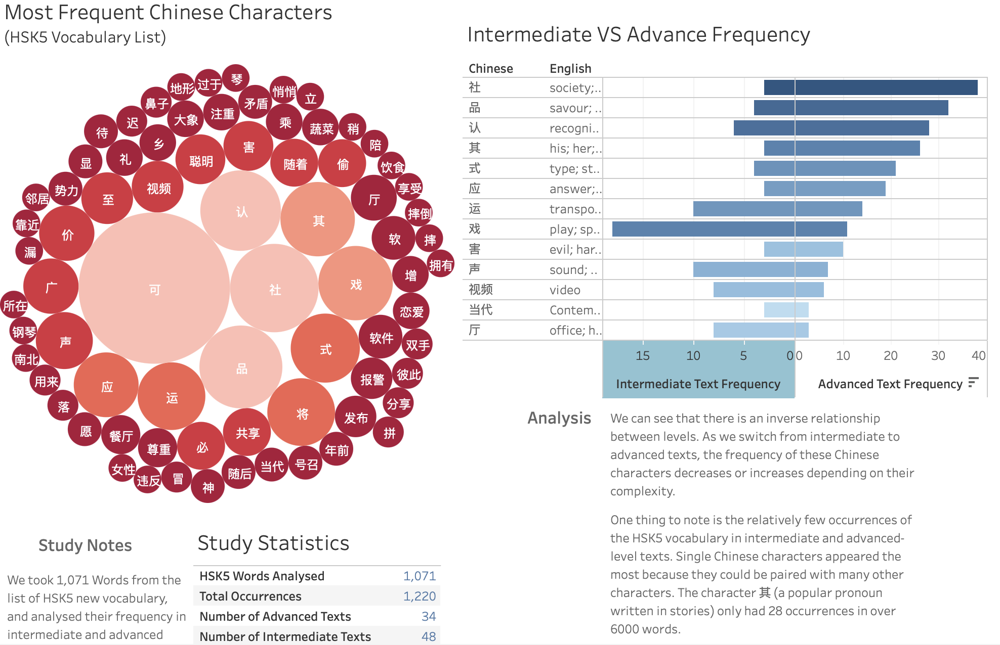

# Analysis of Electric Vehicle 2024 with Projections

## 4. Analysis of 2024 Electric Vehicle Markets with Projections for 2035

**Motivation:** The electric vehicle (EV) market is rapidly evolving, with significant implications for the automotive industry and environmental policies. This project involved analyzing the current state of the electric vehicle market in 2024, including key trends and market dynamics. Additionally, projections for the EV market in 2035 were developed to understand future growth trajectories and potential challenges. The goal was to provide insights that could guide strategic planning and investment decisions in the EV sector.
## Resources

- **OneDrive Link:**
  [Access Tableau Dashboard]([https://public.tableau.com/app/profile/tristan.cross/viz/IEAGlobalEVData2024/EVSalesAccordingtoIEA)](https://public.tableau.com/app/profile/tristan.cross/viz/AnAnalysisofHSK5CharacterFrequencyinIntermediatetoAdvancedText/Dashboard1#1)
  

